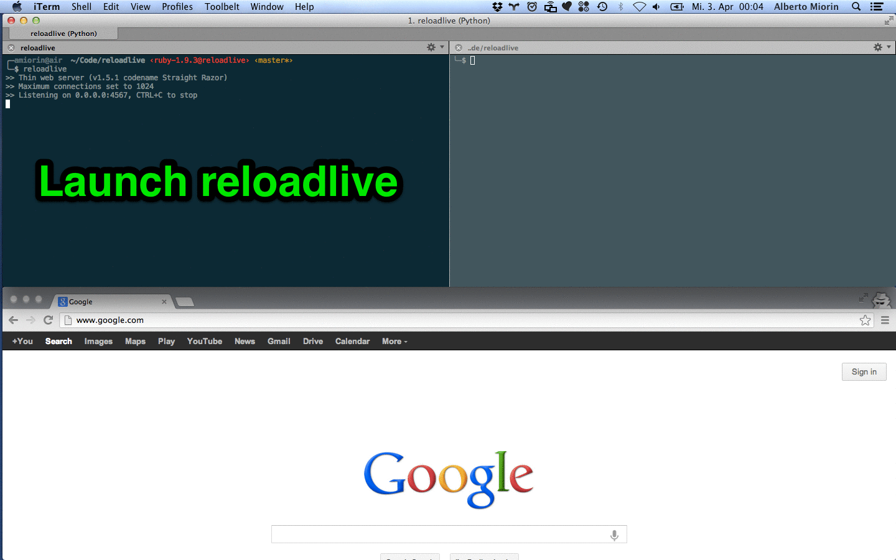

# Reloadlive  
Reloadlive is a command line tool that renders your markup files in your
browser without hitting the reload button.

You need only to save them. The last saved file will be rendered.

If the extension of the file is unknown, the content will be rendered in the
browser without modification.

## Markups

The following markups are supported.  The dependencies listed are required if
you wish to run the library.

* [.markdown, .mdown, .md](http://daringfireball.net/projects/markdown/) -- `gem install redcarpet` (https://github.com/vmg/redcarpet)
* [.textile](http://www.textism.com/tools/textile/) -- `gem install RedCloth`
* [.rdoc](http://rdoc.sourceforge.net/) -- `gem install rdoc -v 3.6.1`
* [.org](http://orgmode.org/) -- `gem install org-ruby`
* [.creole](http://wikicreole.org/) -- `gem install creole`
* [.mediawiki](http://www.mediawiki.org/wiki/Help:Formatting) -- `gem install wikicloth`
* [.rst](http://docutils.sourceforge.net/rst.html) -- `easy_install docutils`
* [.asciidoc](http://www.methods.co.nz/asciidoc/) -- `brew install asciidoc`
* [.pod](http://search.cpan.org/dist/perl/pod/perlpod.pod) -- `Pod::Simple::HTML`
  comes with Perl >= 5.10. Lower versions should install Pod::Simple from CPAN.

## Installation

    $ gem install reloadlive

## Usage
In the directory containings your files run:

    $ reloadlive

and open ``http://localhost:4567`` in your browser.

    $ reloadlive --help

prints the help

## Notes
* Reloadlive can be used instead of ``gollum`` or ``jekyll --auto``
* Internal wiki links don't work yet (to be done).
* The user cannot use his own layout (to be done).
* The current layout is not responsive (to be fixed).

## Links
* [The Zen of Wiki with Gollum](http://albertomiorin.com/blog/2013/03/25/the-zen-of-wiki-with-gollum/)

## Credits
* [Gollum][0]
* [Github markup][1]
* [Faye][2]
* [Thin][3]
* [Rack][4]
* [Sinatra][5]
* [Listen][6]
* [instant-markdonw-d][7]
* [LiveReload][8]

## Contributing

1. Fork it
2. Create your feature branch (`git checkout -b my-new-feature`)
3. Commit your changes (`git commit -am 'Add some feature'`)
4. Push to the branch (`git push origin my-new-feature`)
5. Create new Pull Request

[0]: https://github.com/gollum/gollum
[1]: https://github.com/github/markup
[2]: http://faye.jcoglan.com/
[3]: http://code.macournoyer.com/thin/
[4]: http://rack.github.com/
[5]: http://www.sinatrarb.com/
[6]: https://github.com/guard/listen
[7]: https://github.com/suan/instant-markdown-d
[8]: http://livereload.com/
